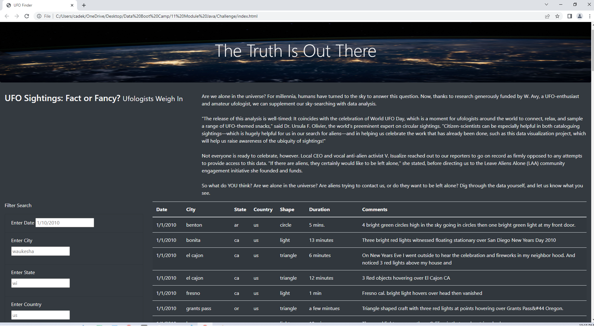
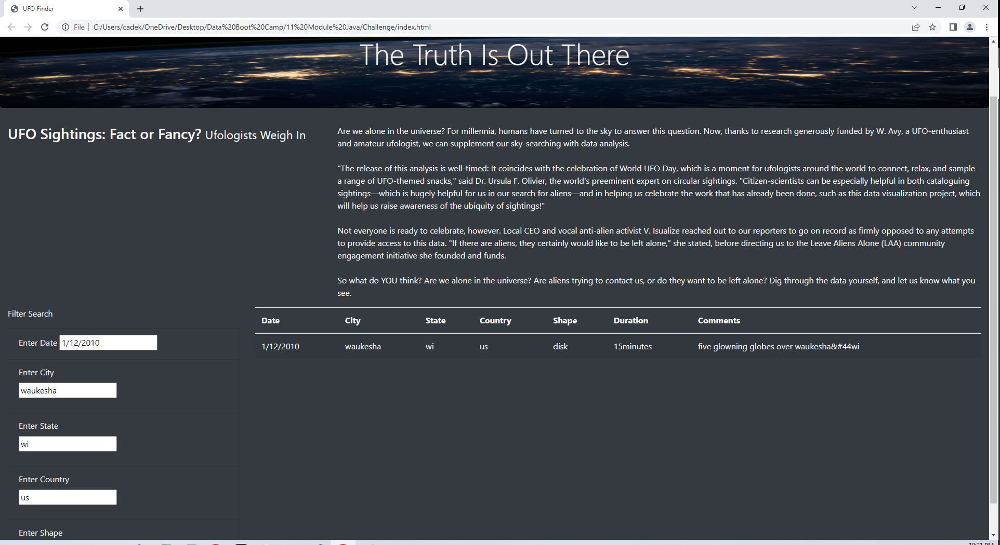

# UFO-Sighting
## Overview Of Project
The purpose of this project is to create a web page utilizing the UFO sighting data provided. With this data we need to create a dynamic table utilizing java script and within that table there needs to be filters that can be used all at once. These filters include: date, city, state, country, and shape of the flying object. These need elements need to be transfered to the webpage and wrapped up nicely with the use of css.
## Results

Once the website is opened you see the header, body of text, the table, and the filter section. To find a UFO sighting you can use one or all filters to find the exact sighting based on date, city, state, country, and object shape.

## Summary
### Drawbacks:
1.  Limited data available reguarding countries and date. (Only US and Canada/ Only 2010)
2.  There is no clear button to clear the search.

### Additional recommendations:

1.  We could have added a charts for better presentation.
2.  instead of type in the values, we could have added a drop down and select from the list.
